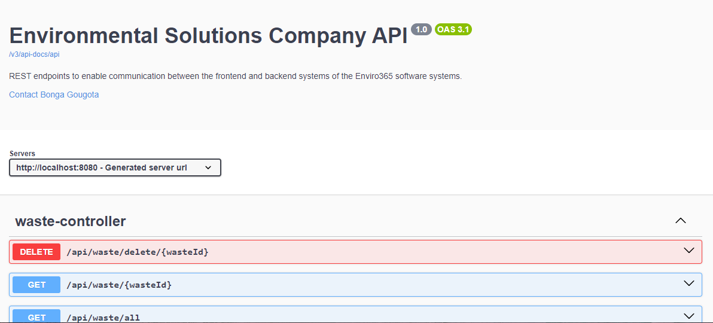

# eTalente Technical Enviro365_Assessment

A Enviro365_Assessment REST API built with Spring Boot, API's documented with Swagger/OpenAPI.



## Features

- RESTful API endpoints following best practices
- Swagger/OpenAPI documentation
- Exception handling and validation
#### NB. project prepopulated with Demo data, navigate to swagger ui for test and to /h2-console for database

## Technologies

- Java 21
- Spring Boot 3.x
- Spring Data JPA
- Swagger/OpenAPI 3.0
- Maven

## Getting Started

### Prerequisites

- Java 17 or higher
- Maven 3.8+
- H2 Database


### Installation

1. Clone the repository:
```bash
git clone https://github.com/BongaGougota0/Enviro365_Assessment.git
cd Enviro365_Assessment
```

2. Configure database properties in `application.properties`:
```properties
spring.h2.console.path=/h2-console
spring.datasource.url=jdbc:h2:mem:enviro365db
spring.datasource.driverClassName=org.h2.Driver
spring.datasource.username=admin
spring.datasource.password=admin
```

3. Build the project:
```bash
mvn clean install
```

4. Run the application:
```bash
mvn spring-boot:run
```

## API Documentation

The API documentation is available through Swagger UI at:
```
http://localhost:8080/swagger-ui/index.html#/
```

## API Endpoints follow the following structure

- `GET      http://localhost:8080/api/{placeholder}/all` - Get all resources
- `GET      http://localhost:8080/api/{placeholder}/{id}` - Get a specific resource
- `GET      http://localhost:8080/api/{placeholder}?category={category_name}` - Get resources by category name
- `POST     http://localhost:8080/api/{placeholder}/post` - Create a new resource
- `PUT      http://localhost:8080/api/{placeholder}/update` - Update a resource (resource posted with a valid id)
- `DELETE   http://localhost:8080/api/{placeholder}/delete/{id}` - Delete a resource

Where {placeholder} is 
placeholder = [recycling, waste, guidelines]

## Error Handling

The API returns standard HTTP status codes and error messages:

- `200 OK` - Success
- `201 Created` - Resource created
- `400 Bad Request` - Invalid request
- `404 Not Found` - Resource not found
- `500 Internal Server Error` - Server error

## Github Link
Project Link: [https://github.com/BongaGougota0/Enviro365_Assessment](https://github.com/BongaGougota0/Enviro365_Assessment)
